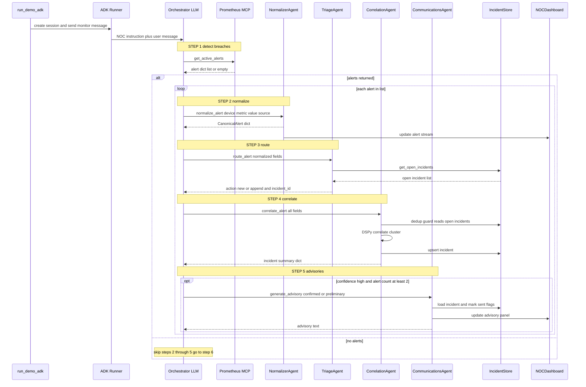
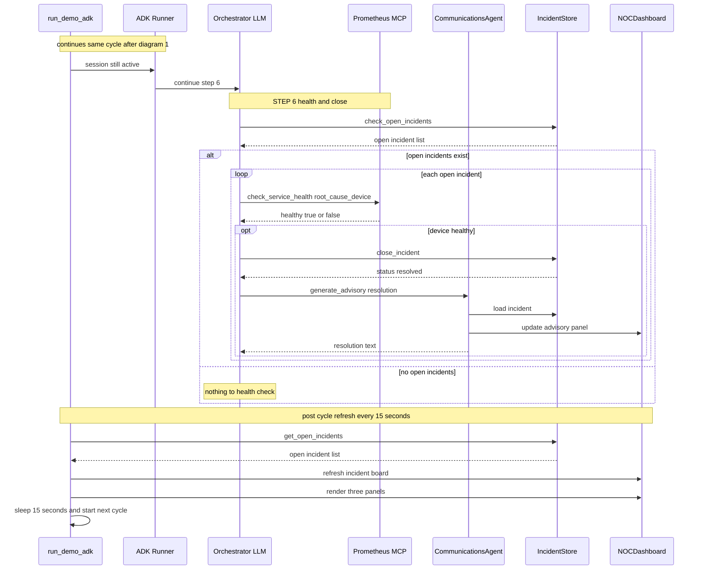
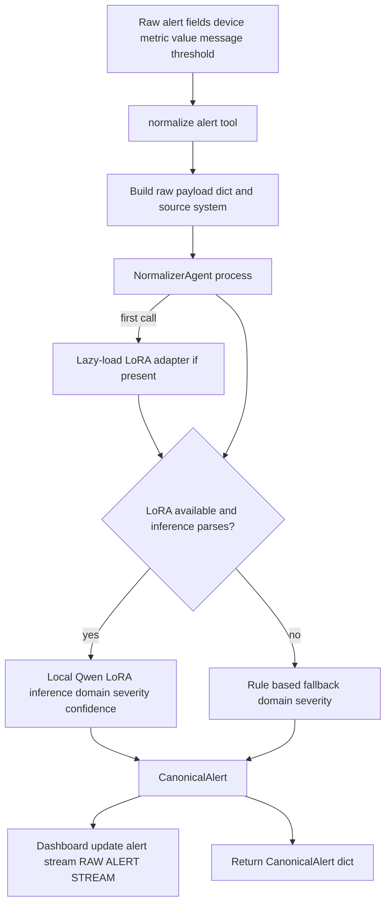
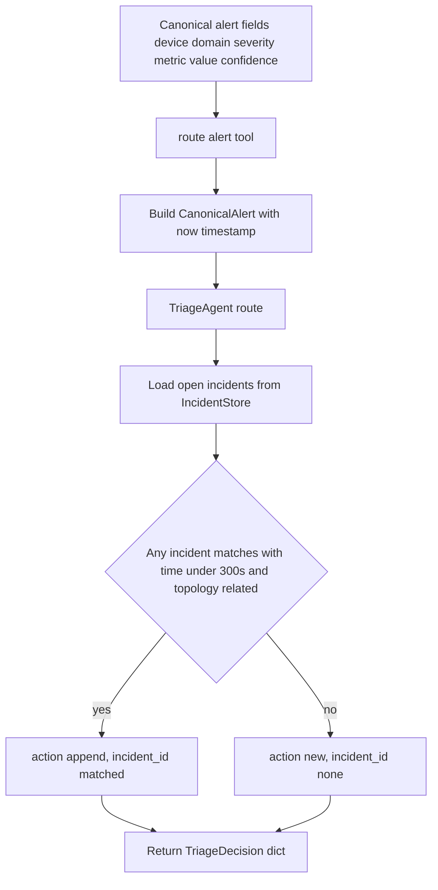
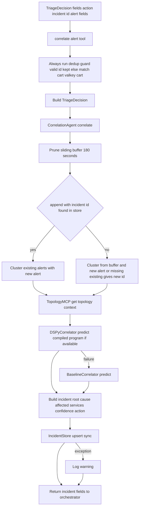
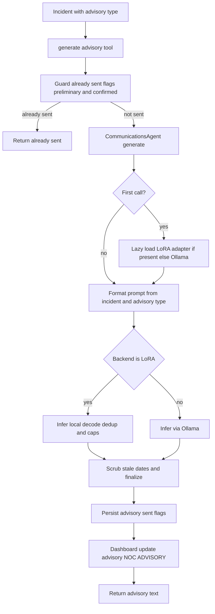
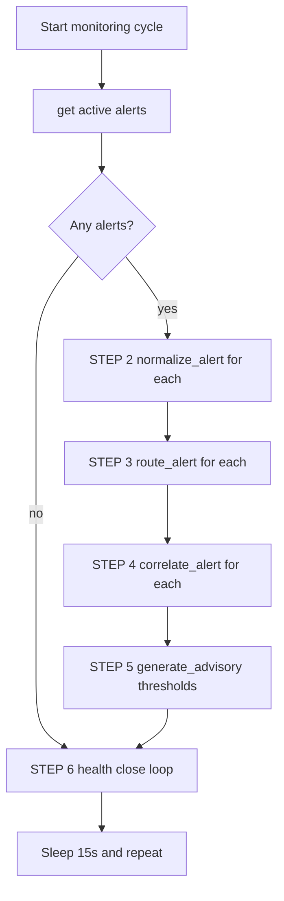

## NOC Whisperer — Agent Mental Models (Demo Ground Truth)

This document is a “mental map” of what each agent does in the **NOC Whisperer** demo, with the minimum detail needed to reason about behavior during a live run.

### The core contract (shared vocabulary)

All agents/tools communicate using three dataclasses from `adapters/canonical_alert.py`:

- **`CanonicalAlert`**: normalized alert (domain, severity, device, metric, confidence)
- **`TriageDecision`**: routing decision (`action: "new"|"append"`, `incident_id`)
- **`Incident`**: incident record (root cause, affected services, confidence, alerts list, advisory flags)

### The ADK demo loop (what actually runs on demo day)

The ADK orchestrator is an LLM that calls tools in order (see `orchestrator/adk_orchestrator.py`). The system behavior is determined by the **tools and agents behind them**, not by free-form LLM reasoning.

High-level sequence per cycle (15s polling in `scripts/run_demo_adk.py`):

- **STEP 1**: `get_active_alerts()` (Prometheus tool wrapper)
- **STEP 2**: `normalize_alert()` (NormalizerAgent tool wrapper)
- **STEP 3**: `route_alert()` (TriageAgent tool wrapper)
- **STEP 4**: `correlate_alert()` (CorrelationAgent tool wrapper + dedup guard)
- **STEP 5**: `generate_advisory()` when thresholds met
- **STEP 6**: health + close + resolution advisory

The three dashboard panels are updated through a shared in-process `NOCDashboard` object:

- RAW ALERT STREAM: `normalizer_tools.update_alert_stream()`
- INCIDENT BOARD: refreshed from `IncidentStore.get_open_incidents()` each cycle
- NOC ADVISORY: `communications_tools.update_advisory()` on successful generation

### ADK cycle sequence diagrams

Two diagrams cover one 15-second poll cycle. Labels are GitHub Mermaid safe — no HTML tags, no special symbols.

#### Diagram 1 — Detection and correlation path (Steps 1 through 5)

Alert ingestion, normalization, routing, correlation, and advisory generation.

#### Diagram 2 — Recovery and cycle wrap (Step 6 plus dashboard refresh)

Health checks for open incidents, closure, resolution advisory, and post-cycle rendering.

**How data moves between tool calls:** the orchestrator LLM reads each tool JSON return and copies scalar fields into the next tool call arguments. Cross-cycle memory lives only in IncidentStore and the dashboard buffers.

**Preview without mermaid.live:** push to GitHub and view this file, or use the VS Code Markdown preview with a Mermaid extension.

---

## Agent 1 — NormalizerAgent

**File**: `agents/normalizer_agent.py`  
**Type**: fine-tuned LoRA model (preferred) with deterministic fallback  
**Tool wrapper**: `agents/adk_tools/normalizer_tools.py` → `normalize_alert()`

### Mental model

“**Turn noisy, source-specific signals into a clean, typed alert**.”

### Inputs

- A small raw payload dict (device, metric, value, threshold, message)
- `source_system` (e.g. prometheus, node_exporter, jaeger, synthetic)

### Outputs

- `CanonicalAlert` with:
  - **domain**: infrastructure | service_mesh | application
  - **severity**: critical | major | minor | warning
  - **confidence**: classifier confidence
  - **device/metric/message/value** normalized into consistent fields

### Key behaviors to remember for the demo

- **Lazy-load**: model loads on first `.process()` call.
- **Fallback exists**: if adapter missing or inference parsing fails, it uses rule-based domain/severity.
- **Dashboard**: successful normalize pushes the alert into RAW ALERT STREAM (last 10).

### Failure modes that show up live

- Model unavailable → rule-based classification (usually still fine for the demo)
- Garbage model output → fallback path, or default domain/severity heuristics

---

## Agent 2 — TriageAgent

**File**: `agents/triage_agent.py`  
**Type**: rule-based (no LLM)  
**Tool wrapper**: `agents/adk_tools/triage_tools.py` → `route_alert()`

### Mental model

“**Decide whether this alert extends an existing incident, or starts a new one**.”

### Inputs

- `CanonicalAlert`
- Open incidents from `IncidentStore.get_open_incidents()`
- Topology relations via `TopologyMCP.are_related()`

### Outputs

- `TriageDecision`:
  - `action="append"` + `incident_id=<existing>`
  - or `action="new"` + `incident_id=None`

### How it matches

An open incident is a match when BOTH are true:

- **Temporal proximity**: alert time within **300s** of `incident.updated_at`
- **Topological proximity**: `topology.are_related(alert.device, incident.root_cause_device)`

### Failure modes that show up live

- If many open incidents exist, the “first matching incident” wins (store ordering matters).
- The ADK wrapper constructs the triage `CanonicalAlert` timestamp at call time (not original Prometheus timestamp).

---

## Agent 3 — CorrelationAgent

**File**: `agents/correlation_agent.py`  
**Type**: DSPy-based correlator (production) with baseline fallback  
**Tool wrapper**: `agents/adk_tools/correlation_tools.py` → `correlate_alert()`

### Mental model

“**Given a cluster of alerts + topology, synthesize the incident story** (root cause, blast radius, confidence, recommended action).”

### Inputs

- `TriageDecision` (alert + action + incident_id)
- Topology context from `TopologyMCP.get_topology_context()`
- Sliding window buffer (180s) when action is `"new"`
- Existing incident alerts when action is `"append"`

### Outputs

- An `Incident` with:
  - `root_cause_device`, `incident_title`, `affected_services`
  - `confidence` (parsed from correlator output)
  - `recommended_action`
  - `alerts` = the full cluster used for reasoning

### What “production” means here

In ADK demo initialization (`agents/adk_tools/correlation_tools.py`), `CorrelationAgent(mode="production")` selects `DSPyCorrelator`.

DSPy correlator behavior (see `dspy_programs/alerts_to_incident.py`):

- Uses a compiled DSPy program when available and API keys are configured
- Falls back to a lightweight heuristic correlator if compiled program fails to load or run

### Critical guardrail (duplicate incident prevention)

The tool wrapper `correlate_alert()` runs a **dedup guard** before building `TriageDecision`. This exists to prevent the orchestrator LLM from creating duplicate incidents (e.g., passing `action="append"` with a bogus `incident_id`).

For the May 30 demo, this guard is the “last line of defense” against incident board explosion.

### Failure modes that show up live

- Bad append `incident_id` → correlation can mint a new UUID unless wrapper guard corrects it
- Silent store write failures → open incidents vanish from `get_open_incidents()` and dedup logic can’t see prior state

---

## Agent 4 — CommunicationsAgent

**File**: `communications/communications_agent.py`  
**Type**: fine-tuned LoRA model (preferred) with Ollama fallback  
**Tool wrapper**: `agents/adk_tools/communications_tools.py` → `generate_advisory()`

### Mental model

“**Convert incident state into operator-ready text**.”

### Inputs

- `Incident`
- `advisory_type`: preliminary | confirmed | resolution

### Outputs

- Advisory text (string), and dashboard panel updated if wired

### When advisories fire in the ADK flow

From `orchestrator/adk_orchestrator.py` instruction:

- **confirmed**: confidence > 0.85 AND alert_count ≥ 2 AND confirmed flag false
- **preliminary**: confidence > 0.50 AND alert_count ≥ 2 AND preliminary flag false
- **resolution**: after health check succeeds and incident is closed

### Demo-grade safeguards (why May 25 issues happened)

Confirmed advisories historically risked repetitive “ACTION REQUIRED” spam due to:

- Prompt wording (“ACTION REQUIRED lines” plural)
- Generous decode parameters and sampling
- Only exact-duplicate line dedup

Mitigations were added in the local inference path to cap and truncate repeated ACTION REQUIRED patterns for the demo.

---

## “Agent 0” — The ADK Orchestrator (not a domain agent, but crucial)

**File**: `orchestrator/adk_orchestrator.py`  
**Type**: tool-calling coordinator (LLM)  
**Mental model**: “**A workflow runner that calls tools**.”

It should be treated like a scheduler:

- It does not own data structures (tools do).
- It does not persist state (IncidentStore does).
- It can make tool-call mistakes (hence dedup guards).

---

## What is persisted vs in-memory (important for demo reasoning)

### Persisted in `IncidentStore` (SQLite)

- The `incidents` table stores incident rows, including:
  - open/resolved status
  - incident metadata
  - full `alerts` JSON list
  - advisory sent flags

### NOT persisted by default

- Advisory text (only held in the dashboard object’s memory)
- Raw alert stream (dashboard memory only)

---

## Practical “demo debugging” checklist

If something looks wrong on the Incident Board:

- **Too many duplicate incidents**:
  - suspect `correlate_alert()` wrapper guard / store visibility
  - look for upsert warnings

- **Confidence not rising / no confirmed advisory**:
  - suspect correlation mode fallback or alert clustering not appending
  - check `alert_count` and incident `confidence` reported by `correlate_alert()`

- **Advisory spam / repetition**:
  - suspect communications prompt + local inference post-processing
  - confirm whether LoRA vs Ollama path was used

